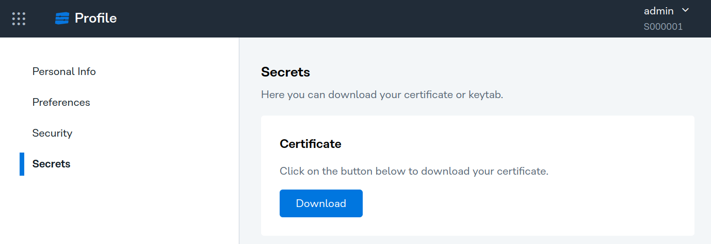
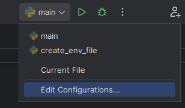
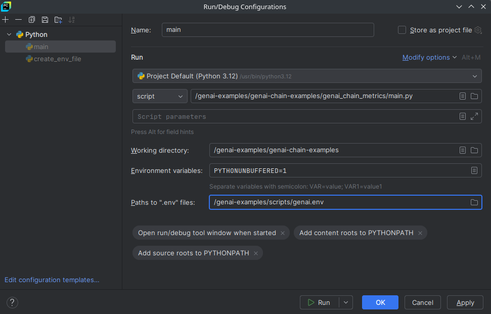

## Stratio GenAI Chain Examples

This repository is intended to developers who want to create GenAI chains. 

This repository provides some simple examples of GenAI chains focused on a specific task.
There are four basic chains that you can use as a starting point to create your own chains:
 # TODO: Add the links to the chains once merged
* [Basic Actor Chain](basic-actor-chain-example/README.md): Examples of a chain that implements a basic actor and invokes it.
* [Stratio Virtualizer Chain](./virtualizer-chain-example/README.md): Example of a GenAI chain that connects to the Stratio Virtualizer service to perform a query.
* [Opensearch Chain](./README.md): Example of a GenAI chain that connects to Opensearch service and processes the result of a search.
* [Memory Chain](./README.md): Example of a GenAI chain that persist the user's conversation in order to remember the context.

Please check the readme of each chain for more information.

## Requirements

### Development tools

To develop the chain you need to install the following tools in your local machine:

* [Python](https://www.python.org/) >= 3.9
* [Poetry](https://python-poetry.org/docs/#installation)
* [PyCharm](https://www.jetbrains.com/pycharm/) or [Visual Studio Code](https://code.visualstudio.com/)

### Stratio GenAI Developer Proxy

You need access to *Stratio GenAI Developer Proxy* service. This service allows you to install the *Stratio GenAI Core* dependency and to access to the services in the Development environment from your local machine. The service is installed by Operations team. They will provide you a URL like this `https://genai-developer-proxy-loadbalancer.s000001-genai.k8s.fifteen.labs.stratio.com:8080`.

### User certificate

You also need to download your user certificate to access the *Stratio GenAI Developer Proxy* service.

1. Access to *Stratio GoSec* to manage your account. You can do it from any Stratio application like *Stratio Talk To Your Data*. In the top right corner, click on your username and select *Manage Account*.


2. In your profile, go to the *Secrets* tab and download the *User certificate*.



3. Uncompress the ZIP file in your local machine. You will find the following files inside:

   * `ca-cert.crt`: Certificate authority
   * `<user>.crt`: User certificate
   * `<user>_private.key`: User key

## Local development

### Clone the repository

Clone the Git repository in your local machine:

```bash
git clone https://github.com/Stratio/genai-examples.git
```

### Configure the environment variables

For local development, you need to configure the user certificates to access the *Stratio GenAI Developer Proxy* service. You need the URL of the service and the path of the folder where you uncompressed the user certificates.

Execute the following commands to configure the environment variables:

```bash
cd genai-examples/scripts
python create_env_file.py \
--certs_path /path/to/certs\
--proxy_url https://genai-developer-proxy-loadbalancer.s000001-genai.k8s.fifteen.labs.stratio.com:8080
```

You will find a `.env` file in the `genai-examples/scripts` folder with the environment variables.

### Install the dependencies

The dependencies are defined in the `pyproject.toml` file, and they are managed by Poetry. First of all, we need to configure the PyPi repository to download the *Stratio GenAI Core* dependency. This dependency is not public, and it is hosted in the *Stratio GenAI Developer Proxy* service.

Change the directory to the desired example chain, as instance `basic-actor-chain-example` folder. This folder contains a basic chain example:

```bash
cd genai-examples/basic-actor-chain-example
```

Edit the `pyproject.toml` file and change the `url` value with the URL of the *Stratio GenAI Developer Proxy* service:

```toml
[[tool.poetry.source]]
name = "stratio-releases"
url = "https://genai-developer-proxy-loadbalancer.s000001-genai.k8s.fifteen.labs.stratio.com:8080/service/genai-api/v1/pypi/simple"
priority = "supplemental"
```

Install the dependencies with Poetry:

```bash
poetry config certificates.stratio-releases.cert false
poetry lock --no-update
poetry install
```

### Configure the IDE (PyCharm)

Open the example chain in PyCharm. Make sure you select a submodule like `genai-examples/basic-actor-chain-example`:

* File => Open => Select the folder

Configure the Python interpreter:

* Python Interpreter => Add New Interpreter => Add Local Interpreter => Poetry Environment => Poetry environment

Execute the chain on PyCharm. This will fail because the environment variables are not configured yet:

* Right-click on the `main.py` file => Run 'main'

Configure the environment variables:

* Edit Configurations => Path to ".env" files => Select the `genai.env` file in the `genai-examples/scripts` folder.





Run the `main.py` file again. This time it will work. You can see the logs in the PyCharm console. You can also open wb interface of the chain in the browser: http://127.0.0.1:8080 

### Useful commands

* Execute all the tests: `poetry run pytest`
* Execute only unit test: `poetry run pytest tests/unit`
* Execute only integration test: `poetry run pytest tests/integration`
* Format the code execute `poetry run black ./`
* Lint the code execute `poetry run pylint './**/'`
* Check the Python's types execute `poetry run mypy ./`
